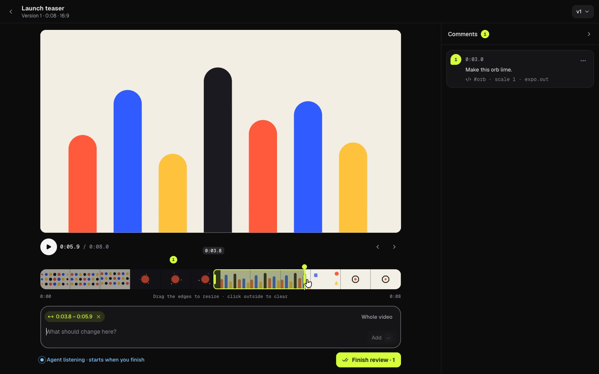
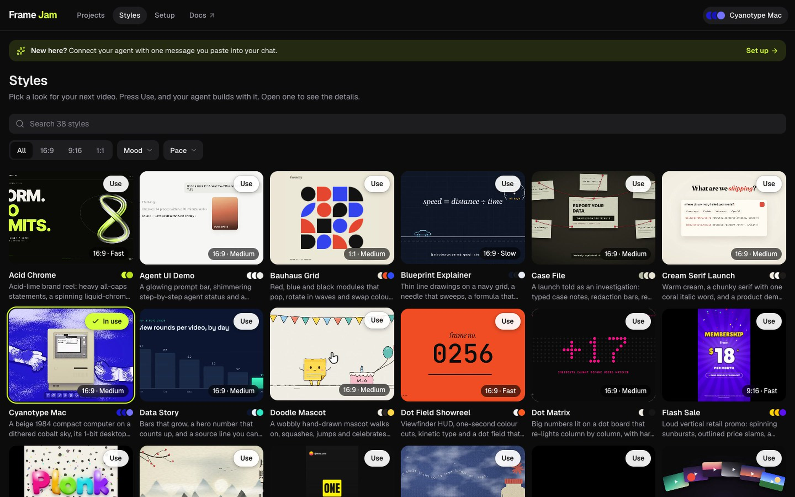
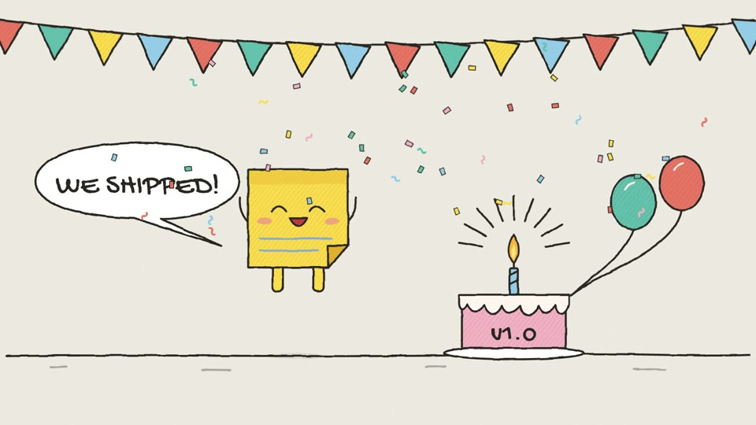
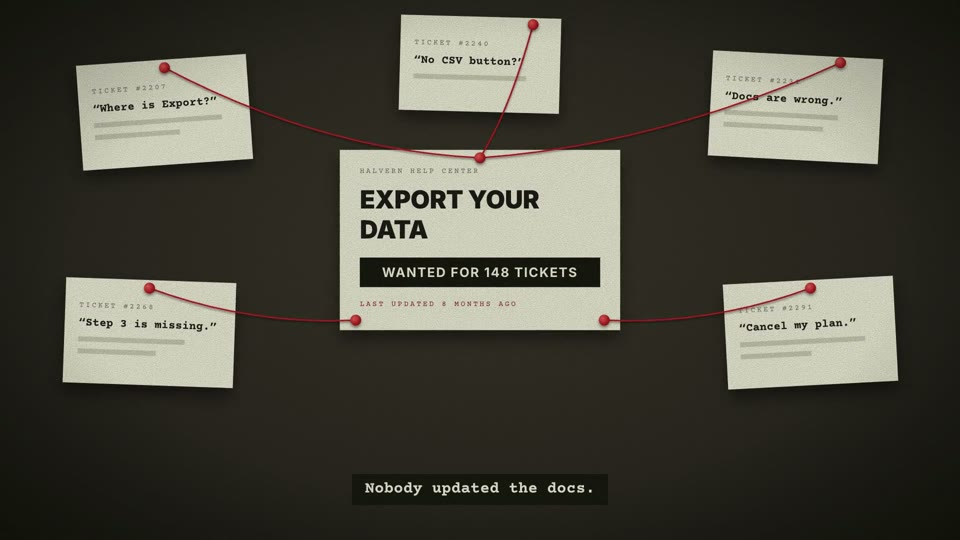
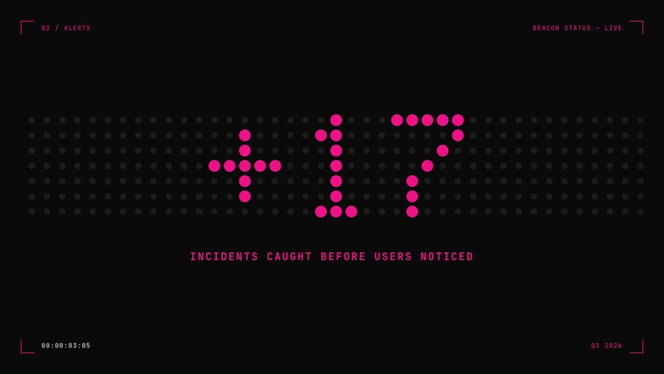
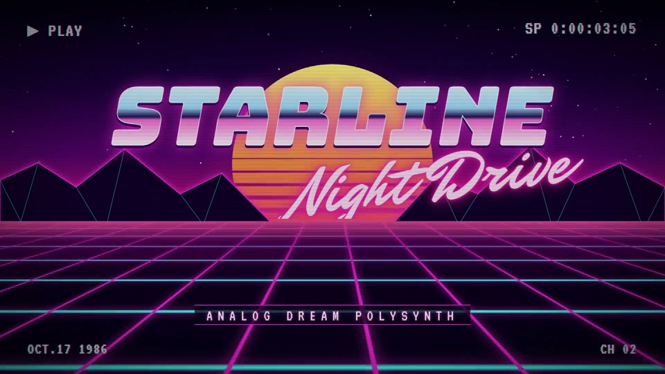

<div align="center">

# FrameJam

**Make videos with your coding agent, and tell it what to change by pointing at the screen.**

Pick a style, let the agent build the video, then click the frame that's wrong and say why.
<br>
Your agent gets the exact timestamp, the element you clicked and the animation behind it.

[Website](https://www.framejam.ai) · [Join the community](https://www.skool.com/promptwarrior) · [Get updates](https://www.framejam.ai/#updates) · [Report an issue](https://github.com/moritzkremb/framejam/issues)

<br>



</div>

<br>

## Why FrameJam

Coding agents are surprisingly good at making videos, with [Hyperframes](https://github.com/heygen-com/hyperframes),
Remotion, Motion Canvas, ffmpeg or whatever your project already uses. The hard part is everything around it. Describing a look in words is slow, and "the thing at around three seconds
should be bigger" is a terrible way to give feedback. FrameJam is a small app that sits next to your agent
(Cursor, Claude Code, ChatGPT desktop) and handles both.

**Pick a style instead of describing one.** Browse 30 example videos and press *Use*. Your agent gets the full
recipe: palette, fonts, easing, transitions, text animations, pacing and a working template.

**Give feedback like you would to a person.** Pause and type, click the thing that's off, or drag across the
timeline to mark a range. Press **Finish review** and your agent gets every comment with its timestamp, a frame
thumbnail of the render.

**Works with any video tool.** Anything that renders an mp4 can be reviewed, and you always review the render.
*Beta:* for Hyperframes, ask your agent for the live player, where a click lands on the exact element and GSAP tween.

**Go round by round.** Each new version from the agent is a fresh round. Old versions keep their comments, so
you can always see what changed and why.

**Runs on your machine.** One local Node process, no account, no upload. Your projects are plain JSON files in
`~/.framejam`. Your videos and comments never leave your machine. The Styles page streams its example videos from
framejam.ai, and the **Feedback** button sends the note you write; nothing else goes out.

## How it works

1. **Pick a look** on the Styles page.
2. **Ask your agent** for a video, for example *"make a 7-second launch teaser with FrameJam and open it for review"*.
3. **Review it** in the browser pane next to your chat: click, type, drag, then press **Finish review**.
4. **Get version 2.** The agent applies your notes and the page switches to the new version on its own. Repeat
   until you love it.

Not ready to animate yet? Ask for a **storyboard** first: one still per shot, which you review the same way.

<div align="center">

</div>

## Quick start

You need **Node 22+** and **ffmpeg** (`brew install ffmpeg` on macOS). Paste this into your agent (shown for Cursor;
use `claude` or `codex` for the other apps):

> Run `npx -y framejam install cursor` and open the link it prints in your built-in browser.

Or run `npx -y framejam install` in a terminal yourself; without an app name it sets up every app it finds. It adds
the FrameJam MCP server to each app, installs the skill with the [skills CLI](https://github.com/vercel-labs/skills),
checks Node and ffmpeg, and starts the app in the background at `http://localhost:2400`. Restart your agent app once
so it loads the new tools (Cursor: reload the window or turn framejam on in Settings → MCP; Codex: Settings → MCP
servers → Restart).

**Updating.** Run `npx -y framejam@latest install` any time: it refreshes the skill and the MCP entry, and replaces an
older FrameJam UI that is still running in the background with the new one. The Projects page shows a notice with
this command when a newer version is on npm (it asks the npm registry at most every 6 hours; set
`FRAMEJAM_NO_UPDATE_CHECK=1` to turn that off). Restart your agent app afterwards so it loads the new version.

After that, typing `/framejam` in your agent is all it takes: the agent opens FrameJam and picks up where you are (a
video you're already editing, feedback waiting, or a new video). Until an agent has connected, the start page shows a
short setup checklist (it stays available at `/setup`). After that, it lists your projects and shows whose turn it is
on each one.

To run from a clone instead:

```bash
git clone https://github.com/moritzkremb/framejam.git
cd framejam
npm install
npm run build
npm start                 # http://localhost:2400  (MCP at http://localhost:2400/mcp)
node dist/server/cli.js install   # points your apps at this clone instead of npm
```

## Connect your agent

`npx -y framejam install` does all of this for you. To set it up by hand, each app needs the MCP server and the
skill; then run `npx -y framejam start` to start the UI. Desktop apps launched from the Dock may not see the `PATH`
from your shell (nvm, fnm): if the server fails to start because `npx` isn't found, use the full path from
`which npx` as the command. When running from a clone, replace `npx -y framejam` with
`node /absolute/path/to/framejam/dist/server/cli.js` and `moritzkremb/framejam` with the clone's path.

<details open>
<summary><b>Cursor</b></summary>

<br>

Add this to `~/.cursor/mcp.json` (or `.cursor/mcp.json` in a project):

```json
{
  "mcpServers": {
    "framejam": {
      "command": "npx",
      "args": ["-y", "framejam", "--stdio"]
    }
  }
}
```

```bash
npx -y skills add moritzkremb/framejam -g -a cursor -y
```

Open `http://localhost:2400` in Cursor's built-in browser so the review sits beside the chat.

</details>

<details>
<summary><b>Claude Code</b></summary>

<br>

```bash
claude mcp add -s user framejam -- npx -y framejam --stdio
npx -y skills add moritzkremb/framejam -g -a claude-code -y
```

Restart Claude Code so it loads the server. It has no built-in browser, so open `http://localhost:2400` yourself.

</details>

<details>
<summary><b>Codex (ChatGPT desktop app)</b></summary>

<br>

```bash
codex mcp add framejam -- npx -y framejam --stdio
npx -y skills add moritzkremb/framejam -g -a codex -y
```

Then restart the MCP servers in Settings → MCP servers.

</details>

<details>
<summary><b>ChatGPT chat mode (or any remote MCP client)</b></summary>

<br>

ChatGPT's chat connectors use MCP over HTTP. Run `npm start`, turn on developer mode for connectors in ChatGPT's
settings, and add a custom connector with this URL:

```
http://localhost:2400/mcp
```

If your ChatGPT build requires an https URL, expose the port with a tunnel (for example
`cloudflared tunnel --url http://localhost:2400`) and set `FRAMEJAM_PUBLIC_URL` to the tunnel URL so the review links
it hands out are reachable.

</details>

<details>
<summary><b>Teach the agent the loop</b></summary>

<br>

[`skills/framejam/SKILL.md`](skills/framejam/SKILL.md) is the skill. `npx skills add moritzkremb/framejam` installs it
for most agents; you can also drop it into `AGENTS.md`. It walks the agent through: ask what to make → pick a preset →
build with the project's tool → render → `open_review` → `wait_for_feedback` (and call it again while the result is
`pending`, up to 12 times in a row, about 10 minutes) → edit → `add_version` with a note, until you say it's done. `.cursor/rules/framejam.mdc` is the same text
as a Cursor rule; regenerate it with `npm run sync:rule` after editing the skill.

</details>

### Try the whole loop without an agent

```bash
npm start                 # terminal 1
npm run e2e               # terminal 2 — plays the agent: picks a preset, opens a review, blocks on wait_for_feedback
```

Open the printed review URL, add a few comments and press **Finish review**. The script prints what the agent
received, then posts v2, and you can watch the page move to it live. `npx tsx scripts/ui-demo.ts` does the browser
side automatically (headless Chrome) and saves screenshots.

## Styles

<table>
<tr>
<td><br><sub><b>Acid Chrome</b></sub></td>
<td><br><sub><b>Cyanotype Mac</b></sub></td>
<td><br><sub><b>Doodle Mascot</b></sub></td>
<td><br><sub><b>Case File</b></sub></td>
</tr>
<tr>
<td><br><sub><b>Dot Matrix</b></sub></td>
<td><br><sub><b>Ink Wash</b></sub></td>
<td><br><sub><b>Synthwave Grid</b></sub></td>
<td><br><sub><b>Parchment Epic</b></sub></td>
</tr>
</table>

FrameJam ships with 30 styles:

**Neon Terminal**, **Noir Quote**, **Data Story**, **Mono Changelog**, **Paper Marker**, **Bauhaus Grid** (1:1),
**Dot Matrix**, **Red Band Title**, **Midnight Launch**, **Cream Serif Launch**, **Agent UI Demo**,
**Dot Field Showreel**, **Blueprint Explainer**, **Topo Credits**, **Parchment Epic**, **Case File**, **Ink Wash**,
**Acid Chrome**, **Recipe Steps**, **Split Flap**, **Label Collage**, **Cyanotype Mac**, **Doodle Mascot**,
**Synthwave Grid**, **Pop Zine**, **UI Microstudy**, **Motion Principles**, **Dither Serif**, **Life Timeline** and
**Storybook Lantern**. More styles, including vertical 9:16 ones, are in the
[Prompt Warrior community](https://www.skool.com/promptwarrior).

Many were studied from the Skillry Opus 5.5 gallery, What Ships launch films and Opus 5.5 videos shared on X, with
original copy and no brand assets. Every one passes `hyperframes lint` with no errors.

<details>
<summary><b>How presets are stored, and making your own</b></summary>

<br>

Presets live in `presets/<id>/` (built-in) and `~/.framejam/presets/<id>/` (yours):

```
presets/neon-terminal/
  style.json          # palette, fonts, easing, transitions, textAnimations, rhythm, guide, format, size
  composition/        # Hyperframes source (index.html + assets)
  preview.mp4         # rendered with `npx hyperframes render`
  poster.jpg
```

The npm package leaves out the built-in `preview.mp4` files to stay small; the Styles page streams them from
`https://www.framejam.ai/presets/<id>/preview.mp4` (override with `FRAMEJAM_PREVIEW_URL`). To add a style pack, unzip
it into `~/.framejam/presets/`.

To re-render the previews:

```bash
npm run render:presets            # or: npm run render:presets -- noir-quote
```

</details>

## The review page

<details>
<summary><b>Rounds, comments and what the agent sees</b></summary>

<br>

- **One round per version.** You add comments to the latest version, then press **Finish review**. That locks the
  version and hands its comments to the agent. The agent's next version starts with an empty list, and older versions
  show their comments greyed out.
- **Changed your mind?** After finishing, **Edit comments** reopens the round. If the agent hadn't picked the comments
  up yet they're simply withdrawn; if it had, finishing again sends a revised list (`revised: true`) that replaces the
  old one.
- **Layout.** The video, timeline and comment box sit on the left; the comments are a list in a sidebar on the right
  that collapses to a rail. Clicking a comment anywhere (pin, timeline marker, corner note) opens the sidebar on it.
  Below 720px wide the sidebar slides over the video instead of taking a column.
- **The comment box** sits under the timeline. It's attached to the current time by default; click the video to attach
  a spot (in live compositions that records the CSS selector, the text, the owning clip and the active GSAP tween),
  drag across the filmstrip to attach a range, or choose *Whole video*. Enter adds the comment.
- **On the video**, a comment shows up only while the playhead is at it: pinned comments as a bubble on their spot,
  time and range comments as a note in the top-left corner. The cursor over the video is a comment bubble.
- **Agent listening.** The page says "Agent listening" while the agent is inside `wait_for_feedback` (and for 15
  seconds between its calls). That only happens while the agent's turn is still running: once it ends its turn, nobody
  is listening, and after you finish the page shows one line to paste into the chat ("Apply my FrameJam feedback for
  rev_…"). It switches to "Your agent is making version N" once the agent picks the comments up.
- **What plays.** The render (mp4). *Beta:* if the agent opened the project with a Hyperframes `compositionDir`, the
  latest version plays the live composition instead (with the official Hyperframes runtime injected from
  `@hyperframes/core`), so clicks can target elements. The live view can differ from the render. If it can't be loaded,
  the page plays the render. Older versions play their mp4 snapshot, so they look as they did then.
- **Keys.** `Space` play/pause, `←/→` step one frame, `Shift+←/→` step one second, `C` focus the comment box,
  `⌘↩` (`Ctrl+Enter`) finish review, `Esc` clear, `?` shortcuts.
- **Copy comments as text** (version menu) copies a version's comments as markdown for harnesses without MCP.

</details>

<details>
<summary><b>Storyboards</b></summary>

<br>

Before anything is animated, an agent can open a storyboard: a set of still panels, one per shot, each with an
optional title and caption (action, camera move, voiceover line, duration).

```ts
open_review({
  title: "Launch storyboard",
  panelsDir: "/abs/project/storyboard",          // every image in the folder, sorted by file name
  panels: [{ path: "01.png", title: "Cold open", caption: "Slow push in. VO: 'Every team ships faster.'" }, "02.png"],
})
```

The review page shows the panels as a **board** (a grid with titles and captions) and a **panel** view (one panel
large, with a strip of all panels underneath). Click a panel on the board to open it, click inside it to pin a spot,
or just type to comment on the whole panel. On the board, the comment box is for the whole storyboard. Keys: `←/→`
previous/next panel, `B` board, `C` comment, `⌘↩` finish review.

Comments reach the agent by panel: `at: "panel 3 (Cold open)"`, with the panel's number, title, caption and image path,
the pin position, and an image of the panel with the pin drawn on it. Rounds, Finish review, Edit comments and versions
work exactly as for videos. Each version keeps its own copy of the panel images, so the agent can overwrite the files
for v2 and v1 still shows what it was.

</details>

<details>
<summary><b>MCP tools</b></summary>

<br>

| Tool | What it does |
| --- | --- |
| `open_review({ title?, videoPath?, compositionDir?, panels?, panelsDir?, reviewId?, note? })` | Opens a review and returns `{ reviewId, url, version }`. `videoPath` is a render from any tool; `compositionDir` (Hyperframes only, beta) adds the live player. Pass `panels`/`panelsDir` instead of a video for a storyboard. Calling it again on the same project adds v2, v3, and so on. |
| `wait_for_feedback({ reviewId, timeoutSeconds? })` | Blocks until the user presses **Finish review**. Returns `{ status: "pending" }` after about 50s; call it again, up to 12 times in a row, then stop and tell the user to say "apply my FrameJam feedback". Sends progress notifications while waiting. |
| `get_feedback({ reviewId?, include? })` | Returns the newest round of comments right away. Without `reviewId` it picks the review whose comments haven't reached the agent yet; unsent comments are sent (and their version locked). Use it when the user says "apply my FrameJam feedback". |
| `list_reviews()` | Lists reviews with their URL and where each round stands (`awaiting_user`, `user_commenting`, `sent_not_delivered`, `delivered_to_agent`). |
| `add_version({ reviewId, videoPath?, compositionDir?, panels?, panelsDir?, note? })` | Attaches a new render (or new storyboard panels) as the next round. It starts with no comments; the `note` is shown to the user. With no media, a storyboard re-reads its `panelsDir`. |
| `resolve_comments({ reviewId, ids, note? })` | Optional bookkeeping for the agent. The UI shows each version as one round instead. |
| `list_presets({ mood?, pacing?, format?, query? })` | Lists the style presets. |
| `get_preset({ id })` | Returns `style.json`, the guide, and the template source files. |
| `get_selected_preset()` | Returns the preset the user picked with *Use this style*. |

Feedback comes back three ways: as JSON (`comments[]` with `at`, `time`, `endTime`, `position`, `element.selector`,
`element.clip`, `element.tweens[]`, `thumbnailPath`), as a markdown prompt, and as inline JPEG frames.

</details>

## Development

```bash
npm run dev        # API on :2400 (tsx watch) + Vite UI on :2401 with a proxy
npm test           # vitest: MCP tools (in-memory, streamable HTTP, stdio) + REST API
npm run typecheck
npm run lint
```

<details>
<summary><b>Project layout and configuration</b></summary>

<br>

| Path | Contents |
| --- | --- |
| `src/server/cli.ts` | CLI entry. `framejam install [cursor\|claude\|codex]` sets up the MCP server and skill for each app (`src/server/install.ts`) and starts the UI; `framejam start` starts the UI in the background (log in `~/.framejam/server.log`) and prints the URL, `--browser` also opens it; `framejam` starts HTTP in the foreground; `framejam --stdio` runs MCP on stdio and also hosts the UI when the port is free. |
| `src/server/mcp.ts` | MCP tool definitions. |
| `src/server/store.ts` | JSON file store. Every call re-reads from disk, so several processes can share `~/.framejam`. |
| `src/server/app.ts` | Hono routes: REST, SSE change feed, media with HTTP range support, composition serving, `/mcp`. |
| `src/web/` | React front end styled by the design system (`src/web/styles/`, generated from `design/`). `lib/composition.ts` handles live playback and element/tween resolution. |
| `design/` | The FrameJam design system: brand book, tokens, component CSS and screen mockups. Open `design/index.html`. |
| `skills/framejam/` | The agent skill (also mirrored as the Cursor rule in `.cursor/rules/framejam.mdc`). |
| `videos/framejam-landing/` | Hyperframes source for the FrameJam landing video (sources only; renders aren't committed). |

Configuration: `--port` / `FRAMEJAM_PORT` (default 2400), `--host` / `FRAMEJAM_HOST` (default 127.0.0.1),
`--data-dir` / `FRAMEJAM_HOME` (default `~/.framejam`), `FRAMEJAM_PUBLIC_URL` (the base URL used in links), and
`FRAMEJAM_PREVIEW_URL` (where the Styles page streams built-in previews from), and `FRAMEJAM_NO_UPDATE_CHECK=1` (don't
look for a newer version on npm).

</details>

<details>
<summary><b>Known limitations (v1)</b></summary>

<br>

- **One UI host per port.** If several harnesses each start `framejam --stdio`, the first one hosts the web UI and the
  others reuse it through the shared data directory. If the hosting process exits, restart one of them (or run
  `npx -y framejam start`).
- **Live preview follows the files on disk.** The live composition always shows the files as they are now, which is
  why older versions play their mp4 snapshot. A version without an mp4 falls back to the current files.
- **Element resolution covers the top-level document.** Sub-compositions mounted with `data-composition-src` play
  correctly, but a click resolves to the mount element, not to nodes inside the sub-composition.
- **Frame thumbnails in live compositions come from the render.** A browser can't rasterise an iframe, so those
  comments get their thumbnail (and the filmstrip its frames) from the version's mp4 when one exists.
- **No MCP Apps embedding yet.** The UI is a plain web page, ready to be embedded later.

</details>

## Join the community

<table>
<tr>
<td>

### Get great at making videos with AI

FrameJam is free and open source. If you want to get really good with it, join
**[Prompt Warrior](https://www.skool.com/promptwarrior)**, the community from the maker of FrameJam:

- **Learn the workflow.** Training for making videos with FrameJam in Claude Code and Cursor.
- **New styles first.** Get new presets before anyone else.
- **Early access.** Try new FrameJam features before they ship.
- **Weekly calls.** Bring your videos, get feedback, and see what others are making.

**[Join Prompt Warrior →](https://www.skool.com/promptwarrior)**

Just want the news? [Sign up for updates](https://www.framejam.ai/#updates) for new styles and releases. No spam.

</td>
</tr>
</table>

<br>

<div align="center">

Built by the maker of [Prompt Warrior](https://www.skool.com/promptwarrior).
Questions, ideas or bugs? Use the **Feedback** button in the app or [open an issue](https://github.com/moritzkremb/framejam/issues).

</div>
